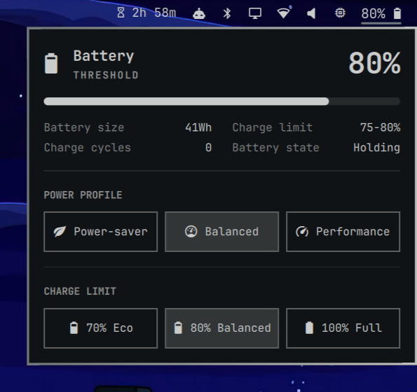

# Battery Oma Limiter 🔋

A unified battery, power profile, and hardware charge-limit widget for [Omarchy](https://omarchy.org).

Cap your laptop's battery charge level directly from your status bar to dramatically extend its lifespan. Rather than adding a redundant second battery icon to your bar, **Battery Oma Limiter** integrates charging thresholds directly into the native Omarchy battery popup—positioned cleanly beneath the **Power Profile** buttons.



---

## ✨ Features

- **Integrated All-in-One Widget**: Replaces the stock power widget with an enhanced version that combines battery telemetry, power profiles, and charge limiting in one panel.
- **Tailored Charge Limit Presets**:
  - **70% Eco** (`󰂀`): Ideal for users who run off battery and recharge frequently. Stays under 4.0V/cell to virtually stop chemical aging while providing real portable runtime.
  - **80% Balanced** (`󰂁`): The industry gold standard (ASUS Balanced Mode, Apple macOS/iOS, EV daily limit). Cuts battery degradation by ~70% compared to 100%.
  - **100% Full** (`󰁹`): Uncapped capacity for travel, flights, or long sessions away from wall outlets.
- **Visually Symmetrical**: Styled with exact 1:1 visual harmony alongside Omarchy's `[ Power-saver ] [ Balanced ] [ Performance ]` buttons.
- **Hardware-Aware**: Automatically discovers your battery's kernel sysfs interface (`charge_control_end_threshold`). If your hardware doesn't support charge limiting, the section is gracefully hidden.
- **Reboot Persistence**: Automatically configures `/etc/tmpfiles.d/battery-limiter.conf` so your selected threshold survives reboots.
- **Zero-Password Switching (Optional)**: Switch thresholds instantly with a single click without repeated password prompts.

---

## 🚀 Installation

Install directly with the Omarchy CLI:

```bash
omarchy plugin add https://github.com/Pierorivera1/Battery-oma-limiter.git --enable
```

### Enabling in your Bar

If you are replacing the default `omarchy.power` widget in your status bar, replace `"omarchy.power"` with `"battery-oma-limiter"` in your `~/.config/omarchy/shell.json`:

```json
{
  "id": "battery-oma-limiter",
  "showPercentage": true
}
```

Then reload the shell:

```bash
omarchy restart shell
```

---

## 🗑️ Removal / Uninstallation

To disable or remove the plugin:

```bash
# Disable the plugin
omarchy plugin disable battery-oma-limiter

# Or remove it completely
omarchy plugin remove battery-oma-limiter --yes
```

If you installed the optional passwordless rule and wish to remove it:
```bash
sudo rm -f /etc/polkit-1/rules.d/90-omarchy-battery-limit.rules /usr/local/bin/omarchy-battery-limit /etc/tmpfiles.d/battery-limiter.conf
```

Restore `"omarchy.power"` in your `~/.config/omarchy/shell.json` if desired, then run `omarchy restart shell`.

---

## ⚡ Optional: Passwordless Mode

Changing kernel sysfs values requires root privileges. By default, clicking a preset uses `pkexec` (standard GUI password prompt).

To enable instant, one-click switching with **zero password prompts**, run the included setup script once:

```bash
~/.config/omarchy/plugins/battery-oma-limiter/scripts/setup-passwordless.sh
```

This installs a Polkit rule in `/etc/polkit-1/rules.d/` authorizing the `wheel` group to update the battery threshold.

---

## 📦 Dependencies

- **None** — No third-party packages or daemons required.
- Reads standard Linux kernel `sysfs` (`charge_control_end_threshold`).
- Uses `polkit`/`pkexec` (part of every Omarchy install).

---

## 💻 Compatibility

Compatible with Omarchy 4.x on any laptop supported by the Linux kernel's battery charge threshold interface:
- **ASUS** (`asus_wmi` / `asus-nb-wmi`)
- **Lenovo ThinkPad** (`thinkpad_acpi`)
- **Framework Laptops**
- **Dell** (`dell_laptop`)
- **LG Gram**, **Huawei**, **System76**, and more.

---

## 📄 License

MIT License. See [LICENSE](LICENSE) for details.
